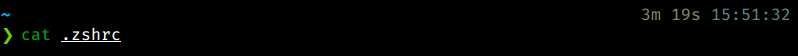

# Plugins no Zsh

No Zsh podemos instalar _plugins_ que adicionam funções e produtividade no uso com o Oh My Zsh, como extensões de navegador por exemplo, vamos instalar 2 plugins para melhorar o nosso Zsh.

## zsh-syntax-highlighting

Adiciona uma syntax Highligth no nosso Zsh, facilitando você saber se o comando que está sendo digitado no momento está correto.

Para instalar, use:

`git clone https://github.com/zsh-users/zsh-syntax-highlighting.git ${ZSH_CUSTOM:-~/.oh-my-zsh/custom}/plugins/zsh-syntax-highlighting`

Agora para definir ele como um dos plugins do seu Zsh, entre em `~/zshrc`, procure uma parte com `plugins=()` e edite:

`plugins=( git, dnf, zsh-syntax-highlighting )`

Agora você verá algo parecido com isso:

Obs: estou usando o tema _Powerlevel10k_ que eu havia comentado no capítulo anterior

## zsh-autosuggestions

Adiciona uma auto-sugestão no Zsh baseada em seu histórico, tornando mais fácil a repetição de comandos já utilizados.

Instale ele na sua máquina:

`git clone https://github.com/zsh-users/zsh-autosuggestions $ZSH_CUSTOM/plugins/zsh-autosuggestions`

edite seu `~/zshrc` para adicionar o plugin na lista:

`plugins=( git, dnf, zsh-syntax-highlighting, zsh-autosuggestions )`

# Parabéns!

Agora você tem toda a magia do Zsh em suas mãos, uma das maneiras mais produtivas de usar o seu terminal, Good Coding!
