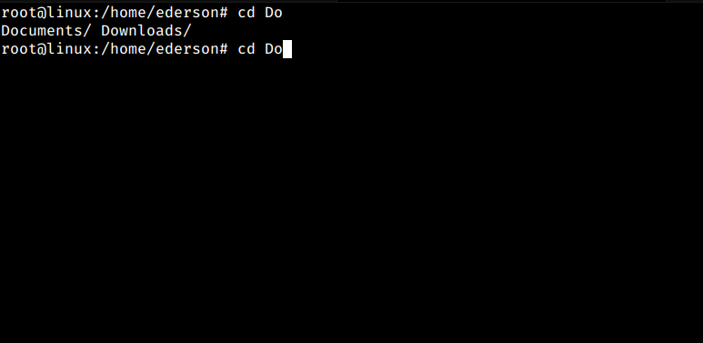
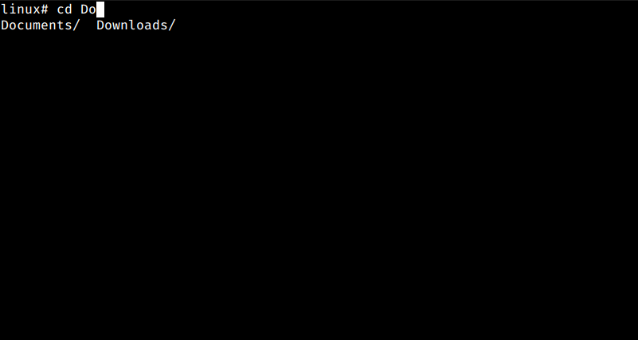

# Tab, o seu melhor amigo!

no Zsh, o Tab é o seu melhor amigo, vamos relembrar que no Bash, para usarmos o Tab para autocompletar o caminho de um arquivo ou diretório, é necessário escrever uma parte do caminho, e verificar se a parte que já foi escrita, não pertence a mais de um arquivo ou diretório, por exemplo:

No bash, caso você digite `cd Do` e aperte tab dentro da sua home, irá aparecer as duas opções, que são `Downloads` e `Documentos` (ou Documents caso seu sistema esteja em inglês), e você precisa apertar mais um caractere para seu tab funcionar e autocompletar o caminho de um desses diretórios:

Mas no Zsh, seu tab se torna uma extensão da sua mente, caso você digite `cd Do` e aperte tab, irá aparecer os diretórios `Downloads` e `Documentos`, mas caso você aperte tab novamente, o Zsh automaticamente selecionará o primeiro, e se apertar denovo, ele irá selecionar o outro, isso que é o interessante do tab do Zsh, entrar em diretórios ou executar arquivos se torna muito rápido, pois você pode rapidamente selecionar arquivos ou diretórios, precisando escrever menos fazendo mais, teste o tab no zsh que você irá entender perfeitamente o seu funcionamento.

## Proximo =>

[Oh My Zsh!](contents/ohmyzsh/README.md)