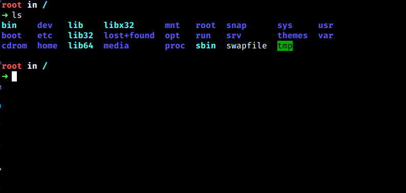

# Temas no Zsh

Agora vamos instalar um tema muito popular, o *Spaceship* usando o Oh My Zsh.

Primeiro para baixar ele no seu sistema, clone o repositório do *Spaceship* usando o Git, dessa maneira:

``git clone https://github.com/denysdovhan/spaceship-prompt.git "$ZSH_CUSTOM/themes/spaceship-prompt"``

Agora crie um Link simbólico dele na pasta do seu Oh My Zsh:

``ln -s "$ZSH_CUSTOM/themes/spaceship-prompt/spaceship.zsh-theme" "$ZSH_CUSTOM/themes/spaceship.zsh-theme"``

Agora entre dentro do arquivo ``~/.zshrc`` que é o arquivo de configuração do seu zsh usando o editor de texto que você escolheu, e edite a variável de ambiente ``ZSH_THEME``, mude o valor corrente dela para ``spaceship``

``ZSH_THEME="spaceship"``

Agora reinicie o terminal e pronto!, o *Spaceship* estará instalado!

Também recomendo que você pesquise o tema *Powerlevel10k*, que é outro tema também muito utilizado e que permite uma altíssima personalização.

## Proximo =>

[Plugins no Zsh](../plugins/README.md)
