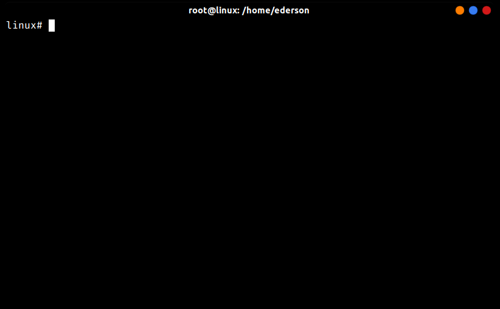

# Usando o Zsh

Nós instalamos o Zsh, agora, para definir ele como shell padrão do nosso sistema, use este comando abaixo para definir o Zsh como shell padrão:

``chsh -s /usr/local/bin/zsh``

Pronto, agora só reiniciar que para o seu usuário, o shell padrão será o Zsh.

Se você quiser executar o zsh sem reiniciar o computador, digite:

``zsh``

O Zsh será iniciado no terminal que você está.

## Proximo =>
[Tab, seu melhor amigo!](../tab/README.md)